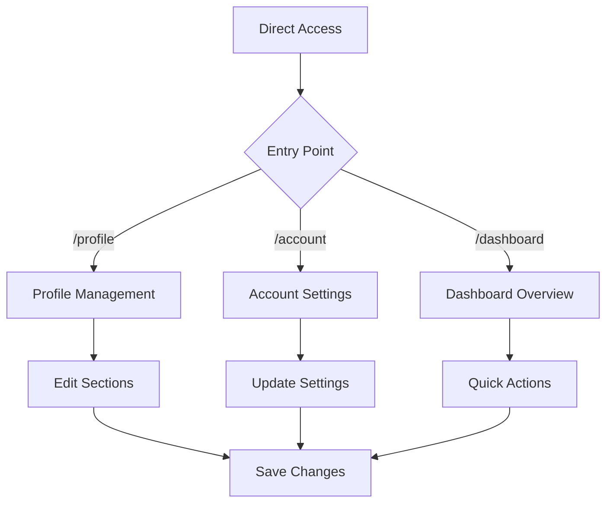
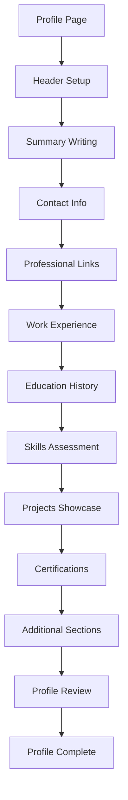

# Site Navigation & User Flow

## Application Sitemap

### Primary Routes

```
/ (Landing Page)
├── Hero Section
├── Features Overview
├── Testimonials
├── Call to Action
└── Footer

/profile (Profile Management)
├── Profile Header (Avatar, Name, Edit)
├── Summary Section
├── Contact Information
├── Professional Links
├── Experience Section
├── Education Section
├── Skills & Competencies
├── Projects Portfolio
├── Certifications
├── Languages
├── Interests
├── Achievements
├── Awards
├── Workflow Visualization
└── Custom Sections

/account (Account Settings)
├── Personal Information
│   ├── Name & Basic Info
│   ├── Contact Details
│   └── Profile Status
├── Identity Verification
│   ├── Document Upload
│   ├── Verification Status
│   └── Government ID
├── Security Settings
│   ├── Password Management
│   ├── Two-Factor Authentication
│   └── Login Activity
└── Preferences
    ├── Theme Settings
    ├── Notification Preferences
    └── Privacy Controls

/dashboard (User Dashboard)
├── Profile Overview
├── Recent Activity
├── Quick Actions
├── Analytics (future)
└── Shortcuts

/404 (Not Found)
├── Error Message
├── Navigation Help
└── Return to Home
```

## User Journey Mapping

### 1. First-Time User Flow

```mermaid
graph TD
    A[Landing Page] --> B{User Interest}
    B -->|Create Profile| C[/profile]
    B -->|Learn More| D[Features Section]
    B -->|See Examples| E[Testimonials]
    C --> F[Profile Setup Wizard]
    F --> G[Basic Info Entry]
    G --> H[Contact Information]
    H --> I[Professional Experience]
    I --> J[Skills & Education]
    J --> K[Profile Complete]
```

### 2. Returning User Flow



### 3. Profile Building Flow



## Navigation Structure

### Main Navigation (Navbar)
- **Home** (/) - Landing page
- **Profile** (/profile) - Profile management
- **Account** (/account) - Account settings
- **Dashboard** (/dashboard) - User dashboard

### Secondary Navigation
- **Theme Toggle** - Available on all pages
- **Mobile Menu** - Collapsible navigation for mobile devices
- **Breadcrumbs** - Context navigation within sections

### Footer Navigation
- **About** - Company information
- **Contact** - Support and contact details
- **Privacy Policy** - Privacy and data protection
- **Terms of Service** - Usage terms and conditions
- **Help** - User guides and documentation

## Page-Specific Navigation

### Profile Page Navigation
```
Profile Management
├── Quick Edit Buttons (inline editing)
├── Section Navigation (anchor links)
├── Save/Cancel Actions
└── Preview Mode Toggle
```

### Account Page Navigation
```
Account Settings
├── Tab Navigation
│   ├── Personal Info
│   ├── Security
│   └── Preferences
├── Form Navigation
│   ├── Save Changes
│   ├── Cancel Edits
│   └── Reset to Default
└── Verification Flows
    ├── Document Upload
    ├── Email Verification
    └── Phone Verification
```

### Dashboard Navigation
```
Dashboard
├── Quick Actions Panel
├── Recent Activity Feed
├── Profile Status Overview
└── Settings Shortcuts
```

## Responsive Navigation Patterns

### Desktop (1024px+)
- Full horizontal navigation bar
- Sidebar navigation for complex pages
- Hover states and dropdowns
- Persistent theme toggle

### Tablet (768px - 1023px)
- Condensed navigation bar
- Collapsible sidebar
- Touch-friendly buttons
- Swipe gestures (future)

### Mobile (< 768px)
- Hamburger menu navigation
- Full-screen overlay menu
- Bottom navigation bar (future)
- Thumb-friendly touch targets

## Accessibility Navigation

### Keyboard Navigation
- **Tab Order:** Logical sequence through interactive elements
- **Skip Links:** Jump to main content, navigation
- **Focus Indicators:** Visible focus states on all interactive elements
- **Keyboard Shortcuts:** Standard web shortcuts supported

### Screen Reader Navigation
- **Landmark Regions:** Header, nav, main, aside, footer
- **Heading Structure:** Proper h1-h6 hierarchy
- **Alt Text:** Descriptive text for all images
- **ARIA Labels:** Enhanced descriptions for complex interactions

### Navigation Announcements
- Route changes announced to screen readers
- Loading states communicated
- Form validation errors clearly announced
- Success messages properly conveyed

## Future Navigation Enhancements

### Planned Features
- **Search Functionality** - Global search across profile sections
- **Bookmarks** - Save favorite sections for quick access
- **History** - Recent edits and changes tracking
- **Shortcuts** - Customizable quick actions
- **Progressive Web App** - App-like navigation experience

### Analytics Integration
- **Page Views** - Track popular sections and pages
- **User Flow** - Understand common navigation patterns
- **Drop-off Points** - Identify where users leave the flow
- **Conversion Tracking** - Monitor profile completion rates

## SEO and Meta Navigation

### URL Structure
- **Clean URLs** - Semantic, readable paths
- **Canonical URLs** - Prevent duplicate content
- **Meta Tags** - Proper title, description, keywords
- **Open Graph** - Social media sharing optimization

### Search Engine Optimization
- **Sitemap.xml** - Machine-readable site structure
- **Robots.txt** - Search engine crawling guidelines
- **Schema Markup** - Structured data for rich snippets
- **Performance** - Fast loading for better rankings

This comprehensive navigation structure ensures users can efficiently access all features while maintaining excellent usability and accessibility standards.